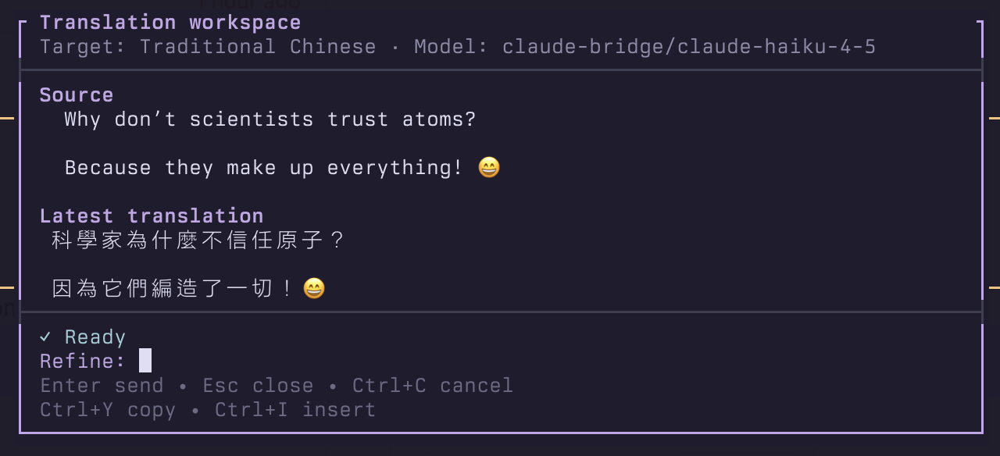

# pi-translation



Clipboard-first translation workspace for Pi. The overlay keeps its conversation separate from the active Pi session while sending translation requests through a selected model provider.

## Install

Install the extension directly from GitHub:

```sh
pi install git:github.com/neighborhood999/pi-translation
```

For a reproducible installation, use a tagged release:

```sh
pi install git:github.com/neighborhood999/pi-translation
```

To try the extension for one Pi process without adding it to your settings:

```sh
pi -e git:github.com/neighborhood999/pi-translation
```

Restart Pi or run `/reload` in an already running interactive Pi session. To upgrade a pinned installation, install the desired newer tag explicitly.

### Local development installation

This standalone pnpm package declares the Pi extension entry point as `./src/index.ts`. Install dependencies, then install the package from its checkout:

```sh
pnpm install
pi install /absolute/path/to/pi-translation
```

The runtime Pi core imports are peer dependencies supplied by Pi. The `devDependencies` are used for local typechecking, linting, formatting, and tests only; `node_modules` must not be committed.

Preferences are stored in `~/.pi/agent/translation.json`, or in the directory selected by `PI_CODING_AGENT_DIR`. That file is not part of this repository.

## Usage

1. Select terminal text and copy it.
2. Run `/translate` in Pi. On macOS, the extension reads the selection with `pbpaste`.
3. Optionally choose a target language for one request with `/translate <language>`, for example `/translate Japanese`. Without an argument, `/translate` uses the configured default.
4. Set that default interactively with `/translate-language`, or directly with `/translate-language Traditional Chinese`.
5. Type a refinement and press **Enter**. Requests such as `more natural`, `formal`, `explain`, and `alternatives` can be used for follow-up turns.

The **Ctrl+Alt+T** shortcut opens the workspace from the clipboard using the configured target language.

After installation, a quick smoke test is:

1. Restart Pi in interactive TUI mode on macOS.
2. Copy a short phrase, press **Ctrl+Alt+T**, and confirm a translation appears in the configured target language.
3. Enter `more natural`, press **Enter**, and confirm the refinement completes.
4. Try **Ctrl+Y** to copy the latest translation, **Ctrl+I** to insert it into Pi's editor, and **Esc** to close the overlay.
5. Optionally run `/translate-model`, select a dedicated model, reopen the overlay, and confirm that its provider/model appears in the header.

## Translation model

Run `/translate-model` to choose a model used only by this extension. Models with configured authentication are listed cheapest-first using their declared input and output prices. Choose **Use current Pi model (default)** to follow Pi's active model again. `/translate-model` may therefore select a dedicated translation model without changing the main conversation's model.

Example with a local Qwen model and Traditional Chinese as the default target:

```json
{
  "provider": "ollama",
  "id": "qwen2.5:7b",
  "targetLanguage": "Traditional Chinese"
}
```

The chosen model appears in the overlay header. Changing the translation model does not change the main conversation's model.

## Overlay controls

- **Enter** — send a refinement
- **Ctrl+Y** — copy the latest translation
- **Ctrl+I** — insert the latest translation into Pi's main editor
- **Esc** or **Ctrl+C** — cancel in-flight work and close/discard

The workspace is a right-side panel on wide terminals and a centered, nearly full-width modal on narrow terminals. Source text and target language remain visible in both layouts.

## Isolation and privacy

The extension keeps its model messages in the overlay and does not add translator turns to Pi's session-message or persistence APIs. Closing the overlay discards that in-memory message history; translation content is not persisted in Pi's session by this extension.

Isolation does not prevent network or provider-side handling: requests go to the selected model provider, and that provider's logging, retention, privacy, and data-handling policy applies. Do not assume that provider-side content is not logged. The extension itself does not intentionally log clipboard, source, or translation text.

## Compatibility and limitations

- Tested with Pi **0.84.4** for noninteractive extension loading and `/translate` command dispatch. Automated tests cover pure helpers and rendering, not interactive TUI behavior, model completion, session isolation, or macOS clipboard integration.
- The Pi overlay API used here is experimental and may change in later releases.
- Pi cannot read an arbitrary terminal selection directly; the selection must be copied first.
- Clipboard acquisition requires macOS `pbpaste`; other clipboard implementations are not provided.
- `/translate` without an argument and **Ctrl+Alt+T** use the configured target language. Close and reopen the workspace with another `/translate <language>` argument to change a single request's target.

## Development

```sh
pnpm format
pnpm format:check
pnpm lint
pnpm typecheck
pnpm test
pnpm check
```

`pnpm check` runs formatting checks, linting with warnings denied, TypeScript checking, and the test suite.
